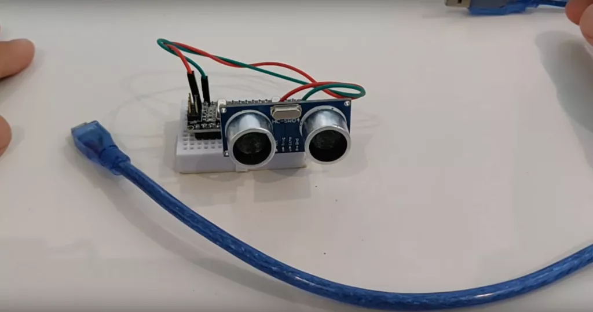

#### Il sensore ad ultrasuoni HC-SR04 è un dispositivo di rilevamento basato sulla tecnologia degli ultrasuoni, che utilizza un segnale sonoro ad alta frequenza per misurare la distanza tra il sensore e un oggetto. 

Questo sensore è ampiamente utilizzato in una vasta gamma di applicazioni, come la robotica, l’automazione industriale, la sicurezza e la domotica.

##### Cosa sono gli ultrasuoni?

Gli ultrasuoni sono onde sonore ad alta frequenza, al di sopra del limite di udibilità dell’orecchio umano, ovvero superiori ai 20.000 Hz. Queste onde sonore si propagano attraverso il mezzo in cui si trovano, come ad esempio l’aria o l’acqua.

Gli ultrasuoni vengono utilizzati in una vasta gamma di applicazioni, come ad esempio la medicina, l’industria, la ricerca, la sicurezza e la robotica. Ad esempio, in medicina gli ultrasuoni vengono utilizzati per diagnosticare e monitorare le condizioni dei pazienti, in particolare per immagini ecografiche. In industria, gli ultrasuoni vengono utilizzati per misurare la distanza, rilevare le imperfezioni nei materiali e per la pulizia ad ultrasuoni.

> Gli ultrasuoni sono generati da dispositivi chiamati trasduttori ad ultrasuoni, che convertono un segnale elettrico in un’onda sonora ad alta frequenza. Quando gli ultrasuoni incontrano un oggetto, parte dell’energia viene riflessa e ritorna al trasduttore. In questo modo, il trasduttore può rilevare la presenza e la posizione dell’oggetto.

Si propagano in svariati mezzi, anche non trasparenti come i metalli  si riflettono sugli oggetti che incontrano. Ciò significa che gli ultrasuoni possono essere utilizzati per rilevare la presenza di oggetti, anche se non visibili, come ad esempio all’interno di una parete o sotto il terreno. Possono essere utilizzati per misurare la distanza grazie alla capacità di misurare il tempo impiegato dal segnale sonoro per viaggiare dalla sorgente al bersaglio e ritornare. Questo principio è utilizzato in diversi dispositivi, come nel sensore che trattiamo in questo post.

Il funzionamento del sensore ad ultrasuoni HC-SR04 è abbastanza semplice. Il sensore invia un impulso sonoro ad alta frequenza nell’ambiente circostante, che viene poi riflesso da un oggetto.

> Gli impulsi ad alta frequenza sono segnali acustici o elettromagnetici che si ripetono rapidamente nel tempo, con una frequenza superiore a quella delle onde sonore udibili dall’orecchio umano (20 Hz – 20.000 Hz). Solitamente si parla di impulsi ad alta frequenza quando la frequenza supera i 100.000 Hz, o 100 kHz. Sono utilizzati in diverse applicazioni, tra cui la comunicazione wireless, la tecnologia radar, la pulizia ad ultrasuoni, la saldatura ad alta frequenza.

Il sensore riceve quindi il segnale riflettente e misura il tempo impiegato dal segnale per viaggiare dalla sorgente al bersaglio e ritornare al sensore. Questo tempo di volo viene poi convertito in una distanza utilizzando una semplice formula matematica.

Il sensore ad ultrasuoni HC-SR04 è in grado di rilevare oggetti entro una gamma di distanze che può variare da pochi centimetri fino a diversi metri, a seconda della configurazione del sensore. Inoltre, il sensore è in grado di rilevare oggetti indipendentemente dal loro colore, forma e consistenza, il che lo rende adatto per una vasta gamma di applicazioni.

 

##### Il sensore ad ultrasuoni HC-SR04 può essere facilmente interfacciato con microcontrollori come l’Arduino o Raspberry Pi, attraverso un’interfaccia digitale come GPIO o PWM. Inoltre, il sensore ad ultrasuoni HC-SR04 è dotato di un’uscita digitale che fornisce un segnale logico ad alta o bassa tensione in base alla presenza o assenza di un oggetto rilevato.

Inoltre, il sensore ad ultrasuoni HC-SR04 è facile da utilizzare e configurare, grazie alla disponibilità di librerie software e di codice di esempio per i principali microcontrollori. Ciò rende il sensore ad ultrasuoni HC-SR04 una scelta ideale per i progetti di robotica e automazione, in cui la rilevazione di oggetti è fondamentale.

In conclusione, il sensore ad ultrasuoni HC-SR04 è un dispositivo di rilevamento semplice ma efficace, che offre una vasta gamma di applicazioni. Grazie alla sua facilità d’uso, al costo contenuto e alle prestazioni elevate, questo sensore è una scelta popolare tra i progettisti di robotica, automazione e sicurezza.

