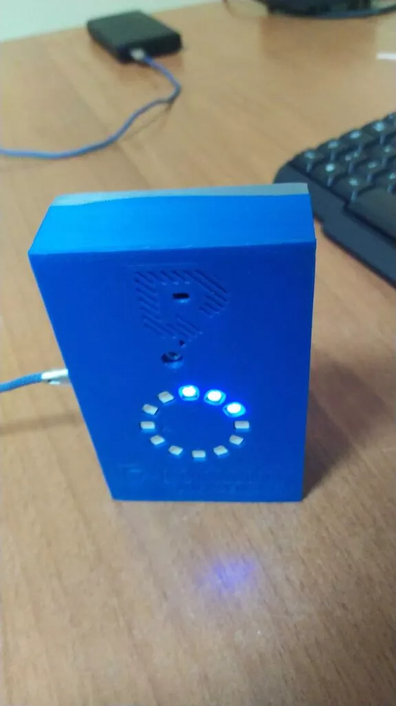

<style>
.x {
    transition:transform 0.60s ease;
}

.x:hover {
    -webkit-transform:scale(1.50); /* or some other value */
    transform:scale(1.50);
}
</style>

#### Da un paio di giorni stiamo assemblando le nuove centraline con sensori di CO<sub>2</sub> [Sensirion SCD30][1] e controller ESP32. Sono destinate a monitorare la concentrazione di [CO<sub>2</sub>][2] nella aule scolastiche e nelle palestre, cinema, e quant&#8217;altro&#8230;

**Perchè è utile conoscere la concentrazione di questo gas?**

> **Perchè l&#8217; Anidride Carbonica** (CO<sub>2</sub>) è strettamente correlata alla diffusione del Covid19. Non la facilita ma viene considerata un buon indicatore di luoghi troppo affollati e perciò a maggior rischio di contagio. Non è pericolosa in sè ma funziona da _semaforo_.

Nella foto puoi vedere la parte inferiore del box realizzata con una stampante 3d [Anycubic Kobra][3] con il sensore incastrato in basso a destra. Al centro della foto la solita breadboard un ESP32 a 38 pin che abbiamo scelto per il progetto.

I dati saranno raccolti sulla nostra piattaforma per IOT, e per l&#8217;output immediato useremo una corona i LED RGB **WS2812B** da 5 V 12-Bit. Se siete curiosi vi illustreremo _DAY by DAY_ lo sviluppo del progettino su questo Blog. Il prodotto finito sarà disponibile sul nostro [Ecommerce][4] entro la fine di Novembre. &#8212; agg.to 04/11/2022: Vi proponiamo intanto il semplice sorgente per calibrare e visualizzare i valori della anidride carbonica:

```bash
#include <Arduino.h>
#include <FastLED.h>
#include <SensirionI2cScd30.h>
#include <Wire.h>

#define LED_PIN     14
#define NUM_LEDS    12
#define BRIGHTNESS  4
#define LED_TYPE    WS2811
#define COLOR_ORDER GRB
#define UPDATES_PER_SECOND 100
#define SEALEVELPRESSURE_HPA (1013.25)
#define HIGH_CO2_BOUNDARY 1200
#define LOW_CO2_BOUNDARY 800

static char errorMessage[128];
static int16_t error;

SensirionI2cScd30 sensor;
CRGB leds[NUM_LEDS];
CRGBPalette16 currentPalette;
TBlendType    currentBlending;

extern CRGBPalette16 myRedWhiteBluePalette;
extern const TProgmemPalette16 myRedWhiteBluePalette_p PROGMEM;
static int64_t lastMmntTime = 0;
static int startCheckingAfterUs = 1900000;

int ppm;
int hum;
int temp;


void setup()
{
    Serial.begin(115200);
    while (!Serial) {
        delay(100);
    }
    Wire.begin();
    sensor.begin(Wire, SCD30_I2C_ADDR_61);

    sensor.stopPeriodicMeasurement();
    sensor.softReset();
    delay(2000);
    uint8_t major = 0;
    uint8_t minor = 0;
    error = sensor.readFirmwareVersion(major, minor);
    if (error != NO_ERROR) {
        Serial.print("Error trying to execute readFirmwareVersion(): ");
        errorToString(error, errorMessage, sizeof errorMessage);
        Serial.println(errorMessage);
        return;
    }
    Serial.print("firmware version major: ");
    Serial.print(major);
    Serial.print("\t");
    Serial.print("minor: ");
    Serial.print(minor);
    Serial.println();
    error = sensor.startPeriodicMeasurement(0);
    if (error != NO_ERROR) {
        Serial.print("Error trying to execute startPeriodicMeasurement(): ");
        errorToString(error, errorMessage, sizeof errorMessage);
        Serial.println(errorMessage);
        return;
    }


    delay(2000);
    FastLED.addLeds<LED_TYPE, LED_PIN, COLOR_ORDER>(leds, NUM_LEDS).setCorrection( TypicalLEDStrip );
    FastLED.setBrightness(  BRIGHTNESS );
    currentPalette = RainbowColors_p;
    currentBlending = LINEARBLEND;

    static uint8_t startIndex = 0;

    for(uint16_t i=0; i<440; i++) {
        ChangePalettePeriodically();
        startIndex = startIndex + 1; /* motion speed */
        SmartFillLEDsFromPaletteColors( i);
        FastLED.show();
        FastLED.delay(1000 / UPDATES_PER_SECOND);
    }
    SetupBlackAndWhiteStripedPalette();
    FillLEDsColor(80);
    FastLED.show();

    for(uint16_t i=0; i<440; i++) {
        ChangePalettePeriodically();
        FillLEDsFromPaletteColors( i );
        FastLED.show();
        FastLED.delay(1000 / UPDATES_PER_SECOND);
    }

    for(uint16_t i=200; i<440; i++) {
        FillLEDsColor(128);
        FastLED.show();
        FastLED.delay(1000 / UPDATES_PER_SECOND);
    }
}

void loop()
{
    float co2Concentration = 0.0;
    float temperature = 0.0;
    float humidity = 0.0;
    delay(1500);
    error = sensor.blockingReadMeasurementData(co2Concentration, temperature,
            humidity);
    if (error != NO_ERROR) {
        Serial.print("Error trying to execute blockingReadMeasurementData(): ");
        errorToString(error, errorMessage, sizeof errorMessage);
        Serial.println(errorMessage);
        return;
    }
    Serial.print("co2Concentration: ");
    Serial.print(co2Concentration);
    Serial.print("\t");
    Serial.print("temperature: ");
    Serial.print(temperature);
    Serial.print("\t");
    Serial.print("humidity: ");
    Serial.print(humidity);
    Serial.println();

    if (co2Concentration > 3000) {
        co2Concentration = 3000;
    }
    float tmp = 0.0;
    clean();
    mostra( int( (co2Concentration-400.0)/150.0) + 1);
    FastLED.show();
    delay(2000);

    static uint8_t startIndex = 0;
}

void FillLEDsColor(uint8_t param)
{
    uint8_t brightness = BRIGHTNESS;

    for( int i = 0; i < NUM_LEDS; i++) {
        leds[i] = ColorFromPalette( currentPalette, param, brightness, currentBlending);
    }
}

void SmartFillLEDsFromPaletteColors( uint8_t colorIndex)
{
    uint8_t brightness = BRIGHTNESS;

    for( int i = 0; i < NUM_LEDS; i+=3) {
        leds[i] = ColorFromPalette( currentPalette, colorIndex, brightness, currentBlending);
        colorIndex += 3;
    }
}

void clean()
{
    for( int i = 0; i < NUM_LEDS; i++) {
        leds[i] =  CRGB::Black;
    }
}

void mostra(uint8_t param)
{
    for( int i = 0; i < param; i++) {
        if (i <3 ) {
            leds[i] =  CRGB::Blue;
        }
        if (i >= 3 && i < 6) {
            leds[i] =  CRGB::Green;
        }
        if (i >=6 && i < 9 ) {
            leds[i] =  CRGB::Yellow;
        }
        if (i >= 9) {
            leds[i] =  CRGB::Red;
        }
        if (i == 11) {
            leds[i] =  CRGB::Violet;
        }
    }
}

void FillLEDsFromPaletteColors( uint8_t colorIndex)
{
    uint8_t brightness = BRIGHTNESS;

    for( int i = 0; i < NUM_LEDS; i++) {
        leds[i] = ColorFromPalette( currentPalette, colorIndex, brightness, currentBlending);
        colorIndex += 3;
    }
}

void ChangePalettePeriodically()
{
    uint8_t secondHand = (millis() / 1000) % 60;
    static uint8_t lastSecond = 99;

    if( lastSecond != secondHand) {
        lastSecond = secondHand;
        if( secondHand ==  0)  {
            currentPalette = RainbowColors_p;
            currentBlending = LINEARBLEND;
        }
        if( secondHand == 10)  {
            currentPalette = RainbowStripeColors_p;
            currentBlending = NOBLEND;
        }
        if( secondHand == 15)  {
            currentPalette = RainbowStripeColors_p;
            currentBlending = LINEARBLEND;
        }
        if( secondHand == 20)  {
            SetupPurpleAndGreenPalette();
            currentBlending = LINEARBLEND;
        }
        if( secondHand == 25)  {
            SetupTotallyRandomPalette();
            currentBlending = LINEARBLEND;
        }
        if( secondHand == 30)  {
            SetupBlackAndWhiteStripedPalette();
            currentBlending = NOBLEND;
        }
        if( secondHand == 35)  {
            SetupBlackAndWhiteStripedPalette();
            currentBlending = LINEARBLEND;
        }
        if( secondHand == 40)  {
            currentPalette = CloudColors_p;
            currentBlending = LINEARBLEND;
        }
        if( secondHand == 45)  {
            currentPalette = PartyColors_p;
            currentBlending = LINEARBLEND;
        }
        if( secondHand == 50)  {
            currentPalette = myRedWhiteBluePalette_p;
            currentBlending = NOBLEND;
        }
        if( secondHand == 55)  {
            currentPalette = myRedWhiteBluePalette_p;
            currentBlending = LINEARBLEND;
        }
    }
}

void SetupTotallyRandomPalette()
{
    for( int i = 0; i < 16; i++) {
        currentPalette[i] = CHSV( random8(), 255, random8());
    }
}

void SetupBlackAndWhiteStripedPalette()
{
    fill_solid( currentPalette, 16, CRGB::Black);
    currentPalette[0] = CRGB::White;
    currentPalette[4] = CRGB::White;
    currentPalette[8] = CRGB::White;
    currentPalette[12] = CRGB::White;

}

void SetupPurpleAndGreenPalette()
{
    CRGB purple = CHSV( HUE_PURPLE, 255, 255);
    CRGB green  = CHSV( HUE_GREEN, 255, 255);
    CRGB black  = CRGB::Black;

    currentPalette = CRGBPalette16(
                         green,  green,  black,  black,
                         purple, purple, black,  black,
                         green,  green,  black,  black,
                         purple, purple, black,  black );
}

const TProgmemPalette16 myRedWhiteBluePalette_p PROGMEM =
{
    CRGB::Red,
    CRGB::Gray,
    CRGB::Blue,
    CRGB::Black,

    CRGB::Red,
    CRGB::Gray,
    CRGB::Blue,
    CRGB::Black,

    CRGB::Red,
    CRGB::Red,
    CRGB::Gray,
    CRGB::Gray,
    CRGB::Blue,
    CRGB::Blue,
    CRGB::Black,
    CRGB::Black
};
```
### Migliorie e case definitivo

Lo sviluppo del sensore di CO2 procede con la versione **semidefinitva.** Abbiamo settato il livelli del primo LED giallo a **1300** parti per milione, leggermente superiore al livello di attenzione di 1200 PPM della normativa elvetica per gli uffici e le aule statali, il secondo led giallo si accende a **1450** di poco inferiore al valore di 1500 PPM previsto dalla normativa italiana. L&#8217;ultimo LED giallo si accende a **1600** PPM quando cioè viene _sicuramente_ superata la soglia prevista dalla normativa italiana. I LED gialli per come abbiamo inteso il sensore _suggeriscono_ che sarebbe il momento di ventilare il locale, mentre i LED rossi misurano un livello di rischio cui non si dovrebbe mai arrivare.




###### Nella immagine una versione di preserie del sensore con case 3D stampato in resina biodegradabile
 [1]: https://sensirion.com/products/catalog/SCD30/
 [2]: https://it.wikipedia.org/wiki/Anidride_carbonica
 [3]: https://www.amazon.it/ANYCUBIC-Pro-Stampante-materasso-riscaldante/dp/B07P7LTNHP/ref=sr_1_17?__mk_it_IT=%C3%85M%C3%85%C5%BD%C3%95%C3%91&keywords=stampante+3d+economica&qid=1665576723&qu=eyJxc2MiOiI1LjU1IiwicXNhIjoiNC44MSIsInFzcCI6IjMuNTgifQ%3D%3D&s=industrial&smid=A3NMBXAME8GJMS&sr=1-17
 [4]: https://www.robotdazero.it/shop/
