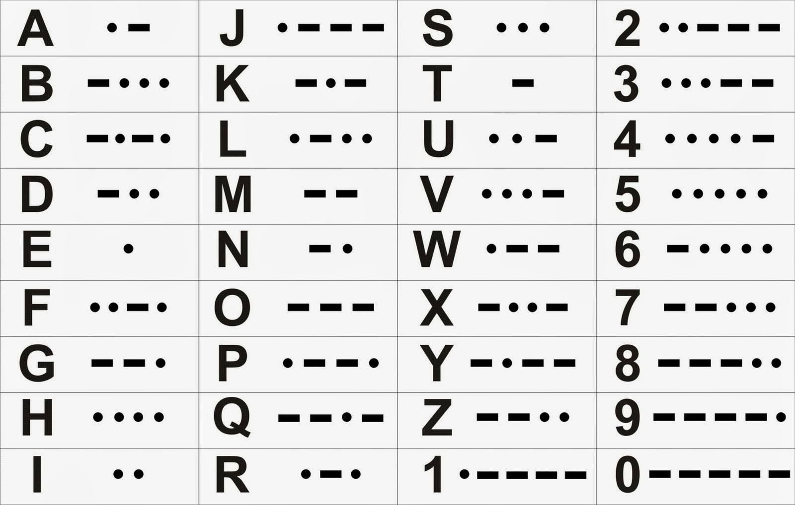
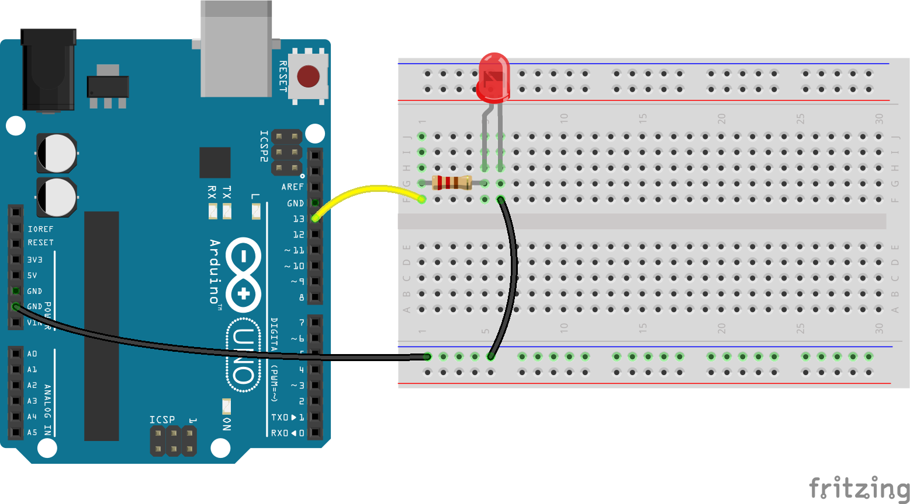

<hr>

##### Come usare Arduino per una applicazione divertente e semplice da capire, ma con alcuni spunti interessanti per approfondire la gestione delle stringhe e dei caratteri con il C++.

#### COS’È IL CODICE MORSE


Il codice Morse è un tipo di comunicazione in uso da molto tempo.
È stato ampiamente utilizzato per oltre un secolo e ha offerto un modo economico per collegare zone, strutture di trasmissione terrestri e ponti radio.

Oggi l’uso del codice Morse è assai diminuito rispetto a 50 anni orsono, ma molti gruppi di radioamatori lo usano ancora per trasmettere messaggi con apparati economici e magari inadatti al traffico vocale.

Inoltre, amministrazioni pubbliche e associazioni possono scegliere il Morse come risorsa estrema per comunicare verso zone remote, prive di telefono o di energia elettrica. Le navi tuttora possono usare il codice Morse per lanciare allarmi, il famoso SOS.
<br>




### PROGRAMMA PER IL LETTORE DI CODICE MORSE

La parte hardware del progettino è molto semplice e per questo motivo preferiamo partire analizzando il sorgente scritto in Arduino C++.

```bash
/*
THE SOFTWARE IS PROVIDED "AS IS", WITHOUT WARRANTY OF ANY KIND, EXPRESS OR
IMPLIED, INCLUDING BUT NOT LIMITED TO THE WARRANTIES OF MERCHANTABILITY,
FITNESS FOR A PARTICULAR PURPOSE AND NONINFRINGEMENT. IN NO EVENT SHALL THE
AUTHORS OR COPYRIGHT HOLDERS BE LIABLE FOR ANY CLAIM, DAMAGES OR OTHER
LIABILITY, WHETHER IN AN ACTION OF CONTRACT, TORT OR OTHERWISE, ARISING FROM,
OUT OF OR IN CONNECTION WITH THE SOFTWARE OR THE USE OR OTHER DEALINGS IN THE
SOFTWARE.
*/

int ledPin = 13;
char* letters[] = {
    “.-”, “-…”, “-.-.”, “-..”, “.”, “..-.”, “–.”, “….”, “..”,
    “.—”, “-.-”, “.-..”, “–”, “-.”, “—”, “.–.”, “–.-”, “.-.”,
    “…”, “-”, “..-”, “…-”, “.–”, “-..-”, “-.–”, “–..”
};
// A-I
// J-R
// S-Z
char* numbers[] = { “—–”, “.—-”, “..—”,
“…–”, “….-”, “…..”, “-….”,
“–…”, “—..”, “—-.” };
int dotDelay = 200;
void setup()
{
    pinMode(ledPin, OUTPUT);
    Serial.begin(9600);
}
void loop()
{
    char ch;
    if (Serial.available()) {
        ch = Serial.read();
        // read a single letter
        if (ch >= ‘a’ && ch <= ‘z’) { flashSequence(letters[ch - ‘a’]); } else if (ch >= ‘A’ && ch <= ‘Z’) { flashSequence(letters[ch - ‘A’]); } else if (ch >= ‘0’ && ch <= ‘9’) {
            flashSequence(numbers[ch - ‘0’]);
        }
        else if (ch == ‘ ‘) {
            delay(dotDelay * 4);
            // gap between words
        }
    }
}
void flashSequence(char* sequence)
{
    int i = 0;
    while (sequence[i] != NULL) {
        flashDotOrDash(sequence[i]);
        i++;
    }
    delay(dotDelay * 3);
}
void flashDotOrDash(char dotOrDash)
{
    digitalWrite(ledPin, HIGH);
    if (dotOrDash == ‘.’) {
        delay(dotDelay);
    }
    else // must be a -
    {
        delay(dotDelay * 3);
    }
    digitalWrite(ledPin, LOW);
    delay(dotDelay);
}
```


### COME FUNZIONA IL PROGRAMMA

Nel loop, controlleremo costantemente se ci sono state inviate delle lettere attraverso il cavo USB. Il flag di Arduino Serial.available() sarà attivata quando arriva un carattere da trasformare in Morse e la funzione Serial.read() ci darà quel carattere e noi lo assegniamo ad una variabile “ch”, che useremo dentro il loop(). A questo punto troviamo delle istruzioni if in sequenza che leggono il carattere e stabiliscono se è una lettera maiuscola, minuscola o uno spazio tra due parole.

Nel primo if cerchiamo di capire se il carattere è compreso tra “a” e “z”. In questo caso, possiamo usare la sequenza di punti e linee all’inizio del programma. Otteniamo la sequenza esatta sottraendo il valore ASCII di “a” da quello del carattere da cambiare. Nel C++ di Arduino possiamo farlo senza problemi perche internamente la rappresentazione di una lettera corrisponde al suo codice numerico.

La stringa trovata viene passata ad una funzione chiamata flashSequence(). La funzione flashSequence cercherà su ogni pezzo del raggruppamento e lo tradurrà in linea o punto.

> Le stringhe in C hanno tutte un codice extra alla fine che indice la fine della sequenza e viene indicato con il termine NULL.

Il loop while continua fino a quando non arriviamo al NULL. La funzione flashDotOrDash() accende il LED e simula un punto o una linea cambiando la lunghezza del segnale. In caso di linea triplica la lunghezza rispetto al punto.


### ASSEMBLAGGIO

Così dovrebbe apparire il montaggio reale:




### I COMPONENTI NECESSARI:

- Arduino Uno R3
- LED D1 5mm Rosso
- R1 270 Ω 0.25W
- Breadboard mini
- Batteria standard 9v
- Plug per batteria 9v compatibile con Arduino

> Per la alimentazione possiamo usare una normalissima batteria da 9 volt reperibile praticamente dovunque, non serve neppure che sia alcalina o ricaricabile visto il bassissimo consumo del LED.


### IL COLLAUDO FINALE

Carica lo scketch facendo poi la compilazione / upload. una volta che il programma è stato caricato su Arduino possiamo usare il Monitor Seriale dove possiamo digitare delle stringhe da mandare ad Arduino. Sempre nel Mnitor Seriale possiamo ricevere le risposte della scheda ai nostri comandi nella sezione superiore.

In alto, c’è un campo in cui è possibile comporre una riga di testo che verrà inviata ad Arduino quando si fa clic su Invia o si preme INVIO. Sotto c’è una zone in cui saranno mostrati tutti i messaggi provenienti dalla scheda Arduino. Direttamente nella parte inferiore della finestra è presente un elenco a discesa in cui è possibile scegliere la velocità di invio delle informazioni. Qualunque cosa selezioni qui dovrebbe coordinare la velocità di trasmissione che indichi nel messaggio di avvio del tuo contenuto. Utilizziamo 9600, che è l’impostazione predefinita, quindi non ci sono ragioni valide per trasformare qualcosa qui. 

Quindi, dovremmo semplicemente inviare il monitor seriale e digitare alcuni contenuti nel campo Invia e premere INVIO. In questo modo dovremmo ottenere il nostro messaggio in codice Morse.


<p style="font-size: 11px;">R.1.0.2</p