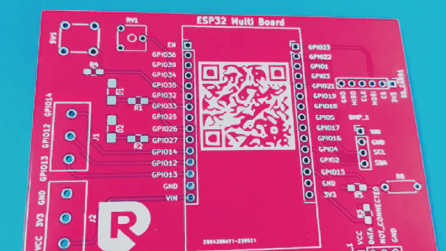

 

<strong>Circuito stampato Multifunzione</strong> per ESP32 con fori metallizzati e maschera per saldature, ideale per sostituire le Breadboard

 

 
 

> Questo circuito stampato realizzato su misura per l’ESP32 ti permette di realizzare la maggior parte dei prototipi che puoi trovare su internet e che altrimenti dovresti abbozzare con la solita breadboard con fili volanti.

 

 👉 
Con la scheda multifunzione per <a href="https://www.robotdazero.it/tags/esp32/" target="_blank" rel="noopener">ESP32</a> puoi costruire i nostri progetti copiando liberamente il software dal sito!

 

##### Tra i nostri progetti puoi trovare:
- Centraline per rilevare gas nocivi
- Centraline Meteo con accesso alle API di OpenWeatherMap 
- Sistemi di sicurezza con riconoscimento delle persone
- Rover guidati da sistemi in Machine Learning

##### Usa la tua email per ricevere un coupon con il 10% di sconto!

