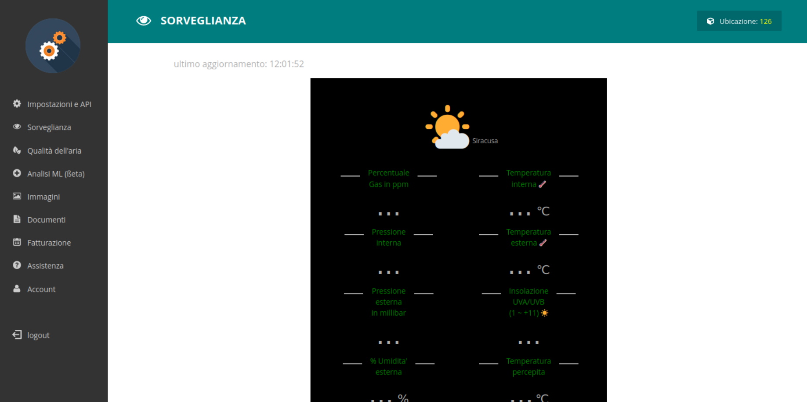

   

      

         <h2 class="display-5 mb-0">Inizia a costo zero</h2>
         
Ti puoi cancellare in qualsiasi momento, senza domande. tutti i prezzi sono IVA inclusa.

      

   

   

      

         
<button class="ps-0 btn-monthly btn btn-link text-dark text-decoration-none fw-bold">Prezzi Mensili</button>
         

      

   

   

      

         

            

               

                  <h4 class="my-0 fw-normal">Free</h4>
               

               

                  <h4 class="card-title">€0<small class="text-muted fw-light"></small></h4>
                  <h6 class="text-muted mt-2">pagamento mensile</h6>
                  <ul class="list-unstyled mt-3 mb-4">
                     <li class="small">100 screenshots</li>
                     <li class="small">20 richieste al minuto</li>
                     <li class="small">no extra allowed</li>
                  </ul>
                  <a class="btn btn-primary px-3 mb-2 shadow w-100" href="https://app.screenshotone.com/sign-up" role="button">Inizia gratis →</a>
               

            

         

         

            

               

                  <h4 class="my-0 fw-normal">Small</h4>
               

               

                  <h4 class="card-title">€19<small class="text-muted fw-light"></small></h4>
                  <h6 class="text-muted mt-2">pagamento mensile</h6>
                  <ul class="list-unstyled mt-3 mb-4">
                     <li class="small">1,500 screenshots</li>
                     <li class="small">40 richieste al minuto</li>
                     <li class="small">€0.009 per extra*</li>
                  </ul>
                  <a class="btn btn-primary px-3 mb-2 shadow w-100" href="https://app.screenshotone.com/sign-up" role="button">Inizia gratis →</a>
               

            

         

         

            

               

                  <h4 class="my-0 fw-normal text-primary">Startup</h4>
               

               

                  <h4 class="card-title">€48<small class="text-muted fw-light"></small></h4>
                  <h6 class="text-muted mt-2">pagamento mensile</h6>
                  <ul class="list-unstyled mt-3 mb-4">
                     <li class="small">10,000 screenshots</li>
                     <li class="small">80 richieste al minuto</li>
                     <li class="small">€0.004 per extra*</li>
                  </ul>
                  <a class="btn btn-primary px-3 mb-2 shadow w-100" href="https://app.screenshotone.com/sign-up" role="button">Inizia gratis →</a>
               

            

         

         

            

               

                  <h4 class="my-0 fw-normal">Business</h4>
               

               

                  <h4 class="card-title">€148<small class="text-muted fw-light"></small></h4>
                  <h6 class="text-muted mt-2">pagamento mensile</h6>
                  <ul class="list-unstyled mt-3 mb-4">
                     <li class="small">50,000 screenshots</li>
                     <li class="small">150 richieste al minuto</li>
                     <li class="small">€0.002 per extra*</li>
                  </ul>
                  <a class="btn btn-primary px-3 mb-2 shadow w-100" href="https://app.screenshotone.com/sign-up" role="button">Inizia gratis →</a>
               

            

         

      

      
<b>Senza carta di credito, pagamenti anche con senza RID.</b>
         *<a href="/book">Cifre addizionali sono richieste solo DOPO gli accordi commerciali.</a> Tutti i piani sono full feature. Hai bisogno di più risorse? <a href="#" onclick="return €crisp.push(['do','message:show',['text','Hello 👋 How many screenshots do you plan to make monthly? And if you need any additional features?']]),€crisp.push(['do','chat:open']),!1">Richiedi un preventivo →</a>
      

   

